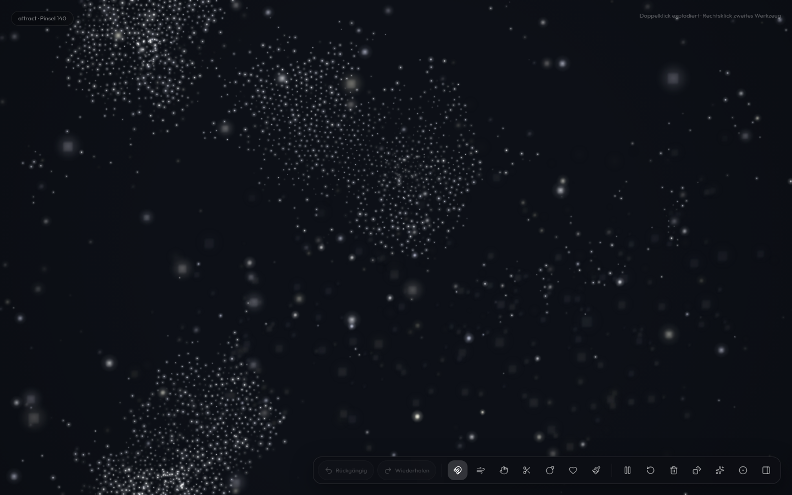

# Lumina

Wir malen weiche Partikel und Rauch im Browser.

**Live:** https://markovigele.github.io/lumina/



## Lokal

```bash
npm install
npm run dev
```

Dann http://127.0.0.1:45219. Auf dem Mac: `Lumina starten.command`. Versionen: [docs/mac.md](docs/mac.md).

Ingeniumowl · [MIT](LICENSE)
